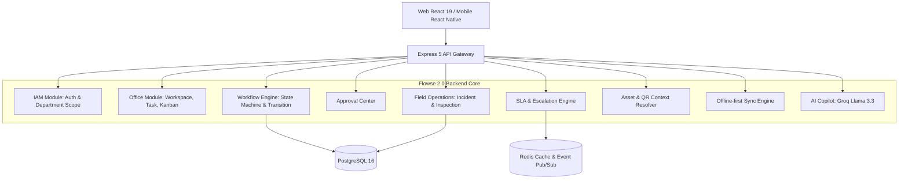

<div align="center">

# 🚀 FLOWSE ENTERPRISE PLATFORM (FLOWSE 2.0)

**Digital Workplace & Enterprise Workflow cho Doanh Nghiệp Sản Xuất**  
*Web & Mobile | Office & Field | Workflow State Machine | SLA Escalation | Offline-first*

[](https://nodejs.org/)
[](https://react.dev/)
[](https://www.typescriptlang.org/)
[](https://www.postgresql.org/)
[](https://vitejs.dev/)
[](https://tailwindcss.com/)
[](https://www.docker.com/)

</div>

---

## 📋 Mục lục

- [1. Giới thiệu tổng quan](#1-giới-thiệu-tổng-quan)
- [2. Kế thừa từ Flowse 1.0 (WebQuanLyDuAn)](#2-kế-thừa-từ-flowse-10-webquanlyduan)
- [3. Tính năng mới trên Flowse 2.0](#3-tính-năng-mới-trên-flowse-20)
- [4. Kiến trúc hệ thống](#4-kiến-trúc-hệ-thống)
- [5. Cấu trúc thư mục](#5-cấu-trúc-thư-mục)
- [6. Hướng dẫn cài đặt & Khởi chạy](#6-hướng-dẫn-cài-đặt--khởi-chạy)
- [7. Danh mục API Endpoints](#7-danh-mục-api-endpoints)

---

## 1. Giới thiệu tổng quan

**Flowse Enterprise Platform (Flowse 2.0)** là nền tảng quản lý công việc và số hóa quy trình nội bộ doanh nghiệp trên Web & Mobile, định hướng phục vụ nhà máy và doanh nghiệp sản xuất. Hệ thống kết nối liền mạch giữa khối **Văn phòng (Office)** và **Hiện trường (Field Operations)** trên một lõi **Workflow Engine** thống nhất.

Dự án được triển khai theo tài liệu đặc tả:
- [FLOWSE_2.0_SRS_v1.1.docx](file:///e:/flowse-enterprise-platform/plan/dev/FLOWSE_2.0_SRS_v1.1.docx)
- [FLOWSE_2.0_De_xuat_de_tai_hoan_chinh.docx](file:///e:/flowse-enterprise-platform/plan/docs/FLOWSE_2.0_De_xuat_de_tai_hoan_chinh.docx)

---

## 2. Kế thừa từ Flowse 1.0 (WebQuanLyDuAn)

Theo quyết định chuẩn hóa trong **SRS v1.1**, dự án kế thừa trực tiếp mã nguồn của Flowse 1.0 (`WebQuanLyDuAn`) với tỉ lệ tái sử dụng trên **70%**:

| Phân hệ kế thừa | Chi tiết tái sử dụng | Trạng thái |
| :--- | :--- | :--- |
| **Xác thực (IAM)** | JWT Access/Refresh Token (HttpOnly Cookie), Google OAuth 2.0, OTP reset pass | ✅ Hoàn tất kế thừa |
| **Work Management** | Quản lý Workspace, Spaces, Folders, Lists, Sprints, Milestones, Time Tracking | ✅ Hoàn tất kế thừa |
| **UI Components** | Kanban Board kéo thả, Sprint View, Time Log Tracker, Modal chi tiết Task | ✅ Hoàn tất kế thừa |
| **Trợ lý AI** | Groq SDK kết nối model Llama 3.3 70B phục vụ AI Copilot | ✅ Hoàn tất kế thừa |
| **Database Baseline** | 25 bảng quan hệ cốt lõi trong `flowise_1.0_baseline.sql` | ✅ Hoàn tất kế thừa |

---

## 3. Tính năng mới trên Flowse 2.0

Flowse 2.0 mở rộng thêm 6 trụ cột doanh nghiệp:

1. **Universal Workflow Engine:** Điều phối vòng đời trạng thái của mọi Work Item (Task, Incident, Inspection, Request) theo State Machine động kèm RBAC role validation và audit trail.
2. **Approval Center:** Trung tâm xét duyệt các yêu cầu, đề xuất vật tư, sự cố cần cấp quản lý phê duyệt đa cấp.
3. **SLA & Escalation Engine:** Tự động tính hạn SLA theo mức độ nghiêm trọng (Critical = 60 phút, High = 120 phút...), cảnh báo nguy cơ trễ hạn (*At Risk*) và quá hạn (*Breached*).
4. **Field Operations (Incident & Inspection):** Tiếp nhận sự cố máy móc tại xưởng, phiếu kiểm tra checklist định kỳ; tự động phát sinh Incident khi checklist bị FAIL.
5. **Asset & QR Context:** Định danh số thiết bị nhà xưởng; quét QR token bằng camera để xem ngay ngữ cảnh máy móc, sự cố đang mở và lịch sử kiểm tra.
6. **Mobile Offline-First & Sync Engine:** Hỗ trợ lưu trữ tạm offline và đồng bộ theo lô (*Batch Sync*) kèm `idempotency_key` chống tạo trùng và kiểm tra xung đột phiên bản `base_version`.

---

## 4. Kiến trúc hệ thống

Hệ thống được tổ chức theo mô hình **Modular Monolith kết hợp Event-driven**:



---

## 5. Cấu trúc thư mục

```
flowse-enterprise-platform/
├── backend/                             # Backend Node.js 20+ / Express 5
│   ├── src/
│   │   ├── config/                      # Kết nối PostgreSQL Pool, migrations
│   │   ├── core/                        # WorkflowEngine.js (State Machine điều phối)
│   │   ├── controllers/                 # Controllers kế thừa và 2.0 mới
│   │   ├── middlewares/                 # Auth, RBAC, RateLimit, Centralized Error
│   │   ├── models/                      # Truy vấn SQL PostgreSQL
│   │   ├── routes/                      # Định tuyến REST API
│   │   └── server.js                    # Entry point Express
│   ├── package.json
│   └── Dockerfile
│
├── frontend/                            # Frontend Web React 19 / TypeScript / Vite 7
│   ├── src/
│   │   ├── api/                         # Axios client (Workflows, Approvals, Incidents, Assets...)
│   │   ├── components/                  # UI shared components
│   │   ├── layouts/                     # AppLayout (Sidebar điều hướng mới)
│   │   ├── pages/                       # Các trang chức năng:
│   │   │   ├── ApprovalCenterPage/      # [MỚI] Trung tâm phê duyệt
│   │   │   ├── IncidentHubPage/         # [MỚI] Quản lý sự cố hiện trường
│   │   │   ├── AssetManagementPage/     # [MỚI] Thiết bị & Ngữ cảnh QR
│   │   │   ├── MyTasksPage/             # [KẾ THỪA] Task của tôi
│   │   │   ├── ListViewPage/            # [KẾ THỪA] Kanban Board
│   │   │   ├── AIPage/                  # [KẾ THỪA] Chatbot AI Copilot
│   │   │   └── ...
│   │   └── store/                       # Redux Toolkit modules
│   ├── package.json
│   └── Dockerfile
│
├── database/                            # Scripts SQL
│   ├── flowise_1.0_baseline.sql         # 25 bảng cốt lõi kế thừa từ 1.0
│   └── 005_flowse_2.0_enterprise_core.sql # Migration mở rộng Flowse 2.0
│
├── plan/                                # Tài liệu thiết kế & phân tích
│   ├── dev/FLOWSE_2.0_SRS_v1.1.docx     # Đặc tả yêu cầu phần mềm v1.1
│   └── docs/FLOWSE_2.0_De_xuat_de_tai_hoan_chinh.docx # Đề xuất đề tài chi tiết
│
├── docker-compose.yml                   # Khởi chạy toàn bộ hệ thống
└── README.md
```

---

## 6. Hướng dẫn cài đặt & Khởi chạy

### Cách 1: Khởi chạy bằng Docker Compose (Khuyên dùng)

1. Sao chép biến môi trường mẫu:
   ```bash
   cp .env.example .env
   cp .env.example backend/.env
   cp frontend/.env.example frontend/.env
   ```
2. Khởi chạy toàn bộ hệ thống (PostgreSQL, Redis, Backend, Frontend):
   ```bash
   docker compose up --build -d
   ```
3. Truy cập:
   - Frontend: [http://localhost:5173](http://localhost:5173)
   - Backend API: [http://localhost:5001](http://localhost:5001)

### Cách 2: Khởi chạy thủ công (Development)

#### Backend:
```bash
cd backend
npm install
npm run dev
```

#### Frontend:
```bash
cd frontend
npm install
npm run dev
```

---

## 7. Danh mục API Endpoints chính

### Flowse 2.0 Enterprise Endpoints:
- `GET /api/v1/workflows` — Danh sách quy trình nghiệp vụ
- `GET /api/v1/workflows/:id` — Chi tiết workflow, states và transitions
- `GET /api/v1/workflows/task/:taskId/transitions` — Lấy các bước chuyển khả dụng cho task
- `POST /api/v1/workflows/task/:taskId/transition` — Thực hiện chuyển đổi trạng thái quy trình
- `GET /api/v1/approvals/pending` — Danh sách yêu cầu chờ phê duyệt
- `POST /api/v1/approvals/:id/decision` — Ra quyết định Approve / Reject
- `GET /api/v1/incidents` — Danh sách sự cố hiện trường
- `POST /api/v1/incidents` — Báo cáo sự cố mới
- `GET /api/v1/assets` — Danh sách thiết bị nhà xưởng
- `GET /api/v1/assets/resolve?token=...` — Giải mã QR token trả về ngữ cảnh số thiết bị
- `POST /api/v1/sync/batch` — Nhận batch đồng bộ ngoại tuyến từ thiết bị Mobile
