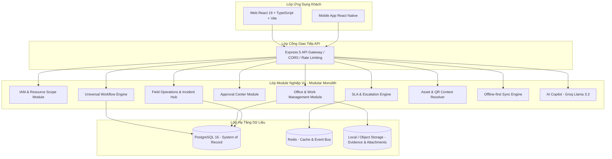

<div align="center">

# 🏭 FLOWSE ENTERPRISE PLATFORM

**Nền tảng Digital Workplace & Enterprise Workflow cho Doanh Nghiệp Sản Xuất**  
*Web & Mobile | Office & Field | State Machine Engine | SLA Escalation | Offline-First*

---

[](https://nodejs.org/)
[](https://expressjs.com/)
[](https://react.dev/)
[](https://www.typescriptlang.org/)
[](https://www.postgresql.org/)
[](https://vitejs.dev/)
[](https://tailwindcss.com/)
[](https://ant.design/)
[](https://www.docker.com/)

</div>

---

## 📋 Mục lục

- [1. Giới thiệu tổng quan](#1-giới-thiệu-tổng-quan)
- [2. Các phân hệ chức năng chính](#2-các-phân-hệ-chức-năng-chính)
  - [2.1. Quản lý công việc văn phòng (Office Collaboration)](#21-quản-lý-công-việc-văn-phòng-office-collaboration)
  - [2.2. Lõi quy trình phổ quát (Universal Workflow Engine)](#22-lõi-quy-trình-phổ-quát-universal-workflow-engine)
  - [2.3. Trung tâm phê duyệt (Approval Center)](#23-trung-tâm-phê-duyệt-approval-center)
  - [2.4. Theo dõi & Cảnh báo SLA (SLA & Escalation Engine)](#24-theo-dõi--cảnh-báo-sla-sla--escalation-engine)
  - [2.5. Tác nghiệp hiện trường (Field Operations: Incident & Inspection)](#25-tác-nghiệp-hiện-trường-field-operations-incident--inspection)
  - [2.6. Định danh thiết bị & Ngữ cảnh QR (Asset & QR Context)](#26-định-danh-thiết-bị--ngữ-cảnh-qr-asset--qr-context)
  - [2.7. Đồng bộ ngoại tuyến (Mobile Offline-First & Sync Engine)](#27-đồng-bộ-ngoại-tuyến-mobile-offline-first--sync-engine)
  - [2.8. Trợ lý trí tuệ nhân tạo (AI Work Copilot)](#28-trợ-lý-trí-tuệ-nhân-tạo-ai-work-copilot)
  - [2.9. Bảo mật, IAM & Phân quyền Resource Scope](#29-bảo-mật-iam--phân-quyền-resource-scope)
- [3. Kiến trúc kỹ thuật](#3-kiến-trúc-kỹ-thuật)
- [4. Cấu trúc mã nguồn](#4-cấu-trúc-mã-nguồn)
- [5. Hướng dẫn cài đặt & Khởi chạy](#5-hướng-dẫn-cài-đặt--khởi-chạy)
- [6. Danh mục API Endpoints](#6-danh-mục-api-endpoints)

---

## 1. Giới thiệu tổng quan

**Flowse Enterprise Platform** là hệ thống quản lý công việc và số hóa quy trình nội bộ doanh nghiệp toàn diện trên nền tảng Web & Mobile. Hệ thống được thiết kế đặc thù cho các doanh nghiệp sản xuất và vận hành công nghiệp, giải quyết triệt để bài toán đứt gãy thông tin giữa khối **Văn phòng (Office)** và khối **Hiện trường/Nhà xưởng (Field Operations)**.

### Triết lý sản phẩm
> **"Web để quản trị và điều phối. Mobile để thực thi công việc. Workflow để điều phối nghiệp vụ."**

- **Hợp nhất dữ liệu:** Gom công việc dự án (Task), sự cố thiết bị (Incident), phiếu kiểm tra bảo trì (Inspection), và phiếu đề xuất nội bộ (Request) về chung một mô hình dữ liệu trừu tượng **Universal Work Item**.
- **Kiểm soát vòng đời chuẩn hóa:** Mọi thay đổi trạng thái đều phải thông qua **Workflow State Machine** với điều kiện chuyển trạng thái, phân quyền vai trò (Role-based) và lưu vết kiểm toán (Audit Trail) chặt chẽ.
- **Liên kết thế giới vật lý với không gian số:** Quét mã QR dán trên máy móc để mở ngay ngữ cảnh số (Digital Context) về tình trạng thiết bị, lịch sử sự cố và checklist bảo dưỡng.

---

## 2. Các phân hệ chức năng chính

### 2.1. Quản lý công việc văn phòng (Office Collaboration)
- **Cơ cấu tổ chức công việc phân tầng:** Workspace (Doanh nghiệp/Dự án lớn) $\rightarrow$ Spaces (Phòng ban/Không gian chức năng) $\rightarrow$ Folders (Thư mục) $\rightarrow$ Lists (Danh sách công việc).
- **Kanban Board trực quan:** Kéo thả linh hoạt các thẻ công việc theo tiến độ, hỗ trợ gán mức độ ưu tiên (*Urgent*, *High*, *Normal*, *Low*), nhãn dán, deadline và người phụ trách (Assignees).
- **Sprint & Milestones:** Lập kế hoạch theo chu kỳ Sprint (*Planning*, *Active*, *Completed*) và theo dõi các mốc mục tiêu quan trọng (Milestones).
- **Time Tracking:** Bấm giờ làm việc trực tiếp trên từng đầu việc, tự động thống kê thời lượng thực tế theo nhân sự và theo không gian làm việc.

### 2.2. Lõi quy trình phổ quát (Universal Workflow Engine)
- **Động cơ máy trạng thái (Dynamic State Machine):** Mỗi Work Item được gắn với một định nghĩa quy trình (`workflow_definitions`) gồm tập trạng thái (`workflow_states`) và các bước chuyển hợp lệ (`workflow_transitions`).
- **Xác thực quyền chuyển bước:** Kiểm tra nghiêm ngặt `allowed_roles` (Admin, Manager, Technician, QA...) và các trường dữ liệu bắt buộc (`required_fields`) trước khi cho phép thay đổi trạng thái.
- **Tự động hóa hành động (Action Triggers):** Tự động dừng đồng hồ tính giờ SLA khi bước chuyển là điểm kết thúc (`is_terminal`), hoặc tự động sinh cảnh báo/thông báo đến các bên liên quan.
- **Lưu vết kiểm toán toàn vẹn:** Mọi bước chuyển đều được ghi nhận vào nhật ký kiểm toán với thông tin người thực hiện, thời gian, trạng thái trước/sau và ghi chú quyết định.

### 2.3. Trung tâm phê duyệt (Approval Center)
- **Giao diện tập trung:** Quản lý và lọc toàn bộ các yêu cầu, đề xuất mua sắm linh kiện, nghiệm thu sự cố đang chờ cấp thẩm quyền xem xét.
- **Quy trình xét duyệt:** Hỗ trợ ra quyết định **Approve (Phê duyệt)** hoặc **Reject (Từ chối)** kèm ghi chú chỉ đạo, tự động cập nhật tiến trình của Work Item tương ứng.

### 2.4. Theo dõi & Cảnh báo SLA (SLA & Escalation Engine)
- **Cam kết thời gian phản hồi & khắc phục:** Thiết lập cấu hình SLA theo mức độ nghiêm trọng (*Critical: 60 phút*, *High: 120 phút*, *Medium: 240 phút*).
- **Đồng hồ đếm ngược:** Theo dõi thời gian thực trạng thái SLA (`IN_SLA`, `AT_RISK`, `BREACHED`).
- **Cơ chế Escalation:** Tự động kích hoạt cảnh báo khi đạt ngưỡng nguy cơ (mặc định 80% thời hạn) và cảnh báo vi phạm SLA đến cấp quản lý.

### 2.5. Tác nghiệp hiện trường (Field Operations: Incident & Inspection)
- **Báo cáo sự cố tức thời:** Nhân viên hiện trường báo cáo nhanh triệu chứng hư hỏng máy móc, đính kèm hình ảnh/bằng chứng (Evidence) tại chỗ.
- **Điều phối kỹ thuật viên:** Trưởng ca phân loại (Triage) và phân công kỹ thuật viên (Technician) tiếp nhận khắc phục.
- **Nghiệm thu QA:** Kiểm tra kết quả xử lý và xác nhận trước khi đóng sự cố.
- **Phiếu kiểm tra bảo dưỡng (Inspection Checklist):** Thực hiện checklist kiểm tra định kỳ từng hạng mục. Nếu hạng mục kiểm tra bị **FAIL**, hệ thống có khả năng tự động tạo Incident liên kết để khắc phục ngay.

### 2.6. Định danh thiết bị & Ngữ cảnh QR (Asset & QR Context)
- **Định danh số:** Quản lý danh mục máy móc, vị trí phân xưởng, thông số kỹ thuật và mã token QR an toàn (Opaque Token).
- **Resolver Ngữ cảnh QR:** Quét mã QR thiết bị từ camera Mobile để truy xuất nhanh:
  - Tình trạng hoạt động của máy.
  - Các sự cố đang mở cần khắc phục.
  - Danh sách checklist kiểm tra định kỳ sẵn có.

### 2.7. Đồng bộ ngoại tuyến (Mobile Offline-First & Sync Engine)
- **Khả năng hoạt động khi mất mạng:** Nhân viên hiện trường vẫn có thể xem danh sách công việc đã cache, tick checklist và ghi nhận sự cố nháp khi làm việc tại khu vực không có sóng.
- **Batch Sync API:** Tự động gom lô các thao tác ngoại tuyến và gửi đồng bộ khi có kết nối trở lại.
- **Chống trùng lặp & Xung đột:** Sử dụng `idempotency_key` chống tạo trùng dữ liệu khi mạng chập chờn và cơ chế Optimistic Locking qua `base_version` để phát hiện và ngăn chặn ghi đè trạng thái cũ.

### 2.8. Trợ lý trí tuệ nhân tạo (AI Work Copilot)
- Tích hợp model **Llama 3.3 70B** thông qua Groq SDK với tốc độ xử lý vượt trội.
- **Tạo việc bằng ngôn ngữ tự nhiên:** Tự động phân tích câu lệnh văn bản để trích xuất tiêu đề, người phụ trách, thời hạn và độ ưu tiên.
- **Phân loại & Gợi ý:** Đề xuất mức độ nghiêm trọng cho sự cố và tóm tắt tiến độ công việc trong các chuỗi thảo luận dài.

### 2.9. Bảo mật, IAM & Phân quyền Resource Scope
- **Xác thực phiên an toàn:** Cơ chế Dual-Token gồm JWT Access Token ngắn hạn và Refresh Token dài hạn lưu trong HttpOnly Cookie chống tấn công XSS.
- **Tích hợp Google OAuth 2.0:** Đăng nhập nhanh chóng, đồng bộ ảnh đại diện và hồ sơ người dùng.
- **Bảo vệ mật khẩu:** Mã hóa bcrypt với salt round cao, xác thực đổi mật khẩu qua mã OTP gửi về email (Resend API).
- **Phân quyền đa tầng (RBAC + Resource Scope):** Phân chia quyền hạn chặt chẽ theo vai trò (*Admin*, *Manager*, *Member*, *Technician*, *QA*) kết hợp phạm vi tài nguyên theo phòng ban/phân xưởng (*Department Resource Scope*).

---

## 3. Kiến trúc kỹ thuật

Hệ thống được xây dựng theo mô hình **Modular Monolith kết hợp Event-Driven**, tối ưu hóa hiệu năng, tính mở rộng và dễ bảo trì:



---

## 4. Cấu trúc mã nguồn

```text
flowse-enterprise-platform/
├── backend/                             # Dịch vụ Backend (Node.js 20+ / Express 5)
│   ├── src/
│   │   ├── config/                      # Cấu hình Database Pool và migrations SQL
│   │   ├── core/                        # WorkflowEngine.js (State Machine điều phối)
│   │   ├── controllers/                 # Bộ điều khiển xử lý logic nghiệp vụ
│   │   │   ├── approvalController.js
│   │   │   ├── assetController.js
│   │   │   ├── departmentController.js
│   │   │   ├── incidentController.js
│   │   │   ├── syncController.js
│   │   │   ├── taskController.js
│   │   │   ├── workflowController.js
│   │   │   └── ...
│   │   ├── middlewares/                 # Xác thực JWT, phân quyền RBAC, Rate Limiting
│   │   ├── models/                      # Tầng truy vấn cơ sở dữ liệu PostgreSQL
│   │   ├── routes/                      # Khai báo các endpoint REST API
│   │   └── server.js                    # File khởi chạy chính Express
│   ├── package.json
│   └── Dockerfile
│
├── frontend/                            # Ứng dụng Web (React 19 / TypeScript / Vite 7)
│   ├── src/
│   │   ├── api/                         # Tầng gọi API Axios (Approvals, Incidents, Assets, Tasks...)
│   │   ├── components/                  # Các UI component tái sử dụng (Modals, Pickers, ContextMenu)
│   │   ├── layouts/                     # Bố cục giao diện AppLayout & Sidebar điều hướng
│   │   ├── pages/                       # Các trang chức năng chính:
│   │   │   ├── ApprovalCenterPage/      # Trung tâm phê duyệt
│   │   │   ├── IncidentHubPage/         # Quản lý sự cố hiện trường
│   │   │   ├── AssetManagementPage/     # Quản lý thiết bị & giải mã QR Context
│   │   │   ├── MyTasksPage/             # Công việc của tôi
│   │   │   ├── ListViewPage/            # Kanban Board & List View
│   │   │   ├── SprintViewPage/          # Quản lý Sprint
│   │   │   ├── TimeTrackingPage/        # Nhật ký bấm giờ làm việc
│   │   │   ├── AIPage/                  # Trợ lý AI Copilot
│   │   │   └── SettingsPage/            # Cài đặt cá nhân & không gian làm việc
│   │   ├── store/                       # Quản lý trạng thái toàn cục với Redux Toolkit
│   │   └── routes/                      # Cấu hình định tuyến React Router
│   ├── package.json
│   └── Dockerfile
│
├── database/                            # Scripts cơ sở dữ liệu
│   ├── flowise_1.0_baseline.sql         # Bộ cấu trúc 25 bảng cốt lõi
│   └── 005_flowse_2.0_enterprise_core.sql # Migration mở rộng Workflow, SLA, Field, Asset, Sync
│
├── plan/                                # Tài liệu kỹ thuật & Đặc tả yêu cầu
│   ├── dev/FLOWSE_2.0_SRS_v1.1.docx     # SRS v1.1 chuẩn ISO/IEC/IEEE 29148
│   └── docs/FLOWSE_2.0_De_xuat_de_tai_hoan_chinh.docx # Thuyết minh đề án chi tiết
│
├── docker-compose.yml                   # Khởi chạy toàn bộ hệ thống bằng 1 lệnh
├── .env.example                         # File mẫu cấu hình biến môi trường
├── .gitignore                           # Cấu hình loại trừ file nhạy cảm và thư viện
└── README.md                            # Tài liệu dự án
```

---

## 5. Hướng dẫn cài đặt & Khởi chạy

### 5.1. Khởi chạy bằng Docker Compose (Khuyên dùng)

Hệ thống đã được đóng gói sẵn sàng với Docker Compose (gồm PostgreSQL 16, Redis 7, Backend API, Frontend Web):

1. **Chuẩn bị cấu hình môi trường:**
   ```bash
   cp .env.example .env
   cp .env.example backend/.env
   cp frontend/.env.example frontend/.env
   ```

2. **Khởi chạy container:**
   ```bash
   docker compose up --build -d
   ```

3. **Truy cập ứng dụng:**
   - Ứng dụng Web: [http://localhost:5173](http://localhost:5173)
   - Cổng Backend API: [http://localhost:5001](http://localhost:5001)
   - Kiểm tra kết nối cơ sở dữ liệu: [http://localhost:5001/db-health](http://localhost:5001/db-health)

---

### 5.2. Khởi chạy trực tiếp cho phát triển (Local Development)

#### Yêu cầu môi trường:
- **Node.js** $\ge$ 20.x
- **npm** $\ge$ 10.x
- **PostgreSQL** $\ge$ 16

#### Bước 1: Khởi tạo Cơ sở dữ liệu
Chạy lần lượt 2 file SQL trong thư mục `database/` vào cơ sở dữ liệu PostgreSQL của bạn:
1. `database/flowise_1.0_baseline.sql`
2. `database/005_flowse_2.0_enterprise_core.sql`

#### Bước 2: Cài đặt & Khởi chạy Backend
```bash
cd backend
cp .env.example .env
# Điền thông tin kết nối DB vào file backend/.env
npm install
npm run dev
```
> Backend chạy tại: `http://localhost:5001`

#### Bước 3: Cài đặt & Khởi chạy Frontend
```bash
cd frontend
cp .env.example .env
npm install
npm run dev
```
> Frontend chạy tại: `http://localhost:5173`

---

## 6. Danh mục API Endpoints

### 🔐 Xác thực & Người dùng (IAM)
| Phương thức | Endpoint | Mô tả |
| :--- | :--- | :--- |
| `POST` | `/api/v1/auth/register` | Đăng ký tài khoản mới |
| `POST` | `/api/v1/auth/login` | Đăng nhập tài khoản & nhận JWT cookies |
| `POST` | `/api/v1/auth/google-login` | Đăng nhập bằng Google OAuth 2.0 |
| `POST` | `/api/v1/auth/refresh-token` | Làm mới Access Token bằng Refresh Token |
| `POST` | `/api/v1/auth/logout` | Đăng xuất và xóa phiên làm việc |
| `GET` | `/api/v1/users/profile` | Lấy thông tin cá nhân của người dùng hiện tại |
| `GET` | `/api/v1/departments` | Lấy danh sách phòng ban trong doanh nghiệp |

### ⚙️ Quy trình nghiệp vụ (Workflow Engine)
| Phương thức | Endpoint | Mô tả |
| :--- | :--- | :--- |
| `GET` | `/api/v1/workflows` | Lấy danh sách các workflow đang kích hoạt |
| `GET` | `/api/v1/workflows/:id` | Lấy chi tiết workflow, danh sách trạng thái và bước chuyển |
| `GET` | `/api/v1/workflows/task/:taskId/transitions` | Lấy các bước chuyển trạng thái khả dụng cho một Work Item |
| `POST` | `/api/v1/workflows/task/:taskId/transition` | Thực hiện bước chuyển trạng thái (State Transition) |

### 🛡️ Trung tâm phê duyệt (Approval Center)
| Phương thức | Endpoint | Mô tả |
| :--- | :--- | :--- |
| `GET` | `/api/v1/approvals/pending` | Danh sách các yêu cầu đang chờ phê duyệt |
| `POST` | `/api/v1/approvals/:approvalId/decision` | Ra quyết định phê duyệt (`APPROVED`) hoặc từ chối (`REJECTED`) |

### 🚨 Quản lý sự cố hiện trường (Incident Management)
| Phương thức | Endpoint | Mô tả |
| :--- | :--- | :--- |
| `GET` | `/api/v1/incidents` | Lấy danh sách các sự cố hiện trường kèm trạng thái và thiết bị |
| `GET` | `/api/v1/incidents/:id` | Lấy chi tiết thông tin sự cố |
| `POST` | `/api/v1/incidents` | Báo cáo sự cố máy móc mới (tự động gắn SLA và khởi tạo task) |

### 🏷️ Quản lý thiết bị & QR Context (Asset & QR Context)
| Phương thức | Endpoint | Mô tả |
| :--- | :--- | :--- |
| `GET` | `/api/v1/assets` | Lấy danh mục thiết bị và máy móc trong nhà xưởng |
| `GET` | `/api/v1/assets/:id` | Chi tiết thiết bị |
| `GET` | `/api/v1/assets/resolve?token=...` | Giải mã mã QR token, trả về ngữ cảnh số thiết bị |
| `POST` | `/api/v1/assets` | Khai báo thiết bị mới vào hệ thống |

### 📲 Đồng bộ ngoại tuyến (Mobile Sync)
| Phương thức | Endpoint | Mô tả |
| :--- | :--- | :--- |
| `POST` | `/api/v1/sync/batch` | Gửi gói đồng bộ ngoại tuyến theo lô kèm `idempotency_key` và `base_version` |

### 📂 Quản lý công việc (Workspaces, Tasks & Projects)
| Phương thức | Endpoint | Mô tả |
| :--- | :--- | :--- |
| `GET` | `/api/v1/workspaces` | Danh sách không gian làm việc của người dùng |
| `GET` | `/api/v1/tasks/my-tasks` | Lấy toàn bộ đầu việc được phân công cho người dùng |
| `POST` | `/api/v1/tasks/lists/:listId` | Tạo task mới trong danh sách |
| `PUT` | `/api/v1/tasks/:taskId` | Cập nhật thông tin chi tiết task |
| `POST` | `/api/v1/timelogs` | Ghi nhận thời gian làm việc trên task |
| `POST` | `/api/v1/ai/chat` | Tương tác thông minh với trợ lý AI Copilot |
